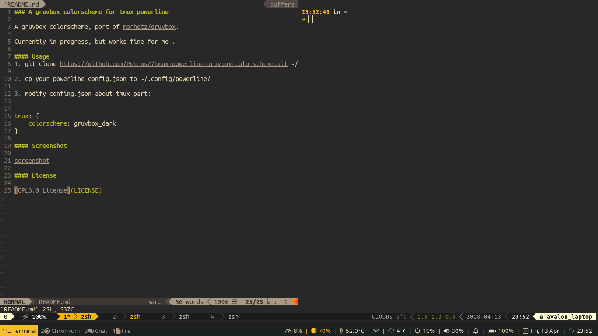

### A gruvbox colorscheme for tmux powerline

A gruvbox colorscheme, port of [morhetz/gruvbox](https://github.com/morhetz/gruvbox).

Currently in progress, but works fine for me. Welcome to report any issues.

#### Usage
1. git clone https://github.com/PetrusZ/tmux-powerline-gruvbox-colorscheme.git ~/.config/powerline

2. cp your powerline config.json to ~/.config/powerline/

3. modify confing.json about tmux part:

```json
"tmux": {
    "colorscheme": "gruvbox_dark"
}
```
#### Screenshot



#### License

[MIT](LICENSE)
